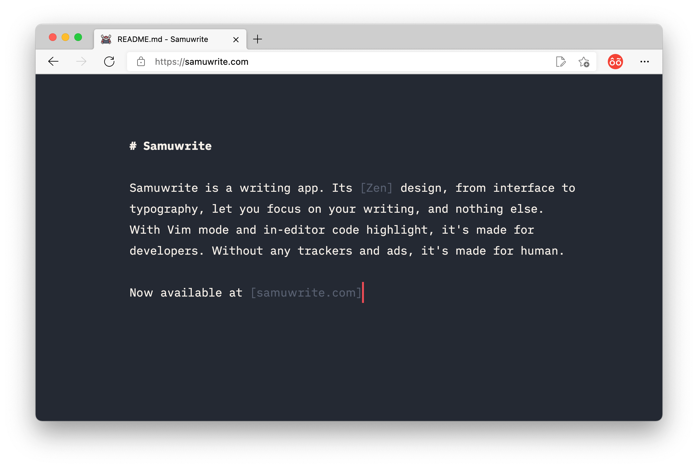
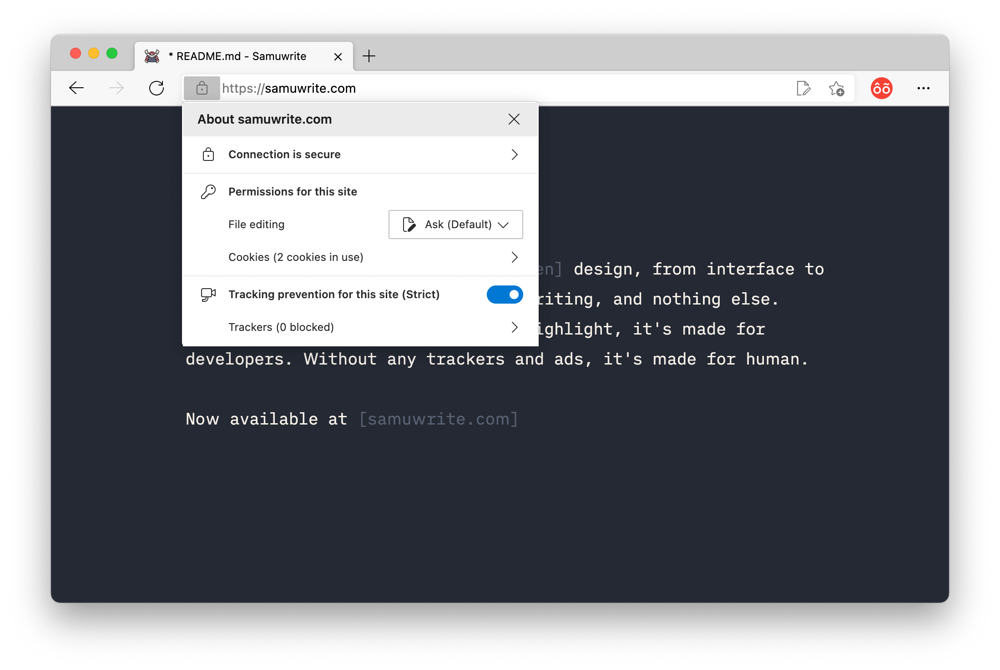
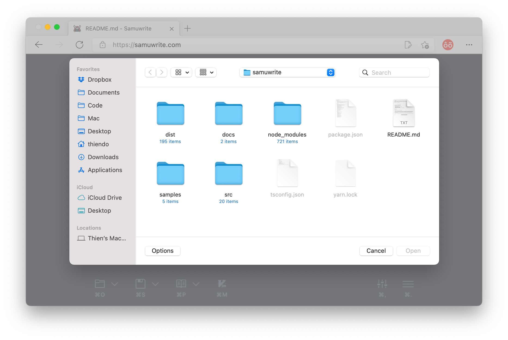
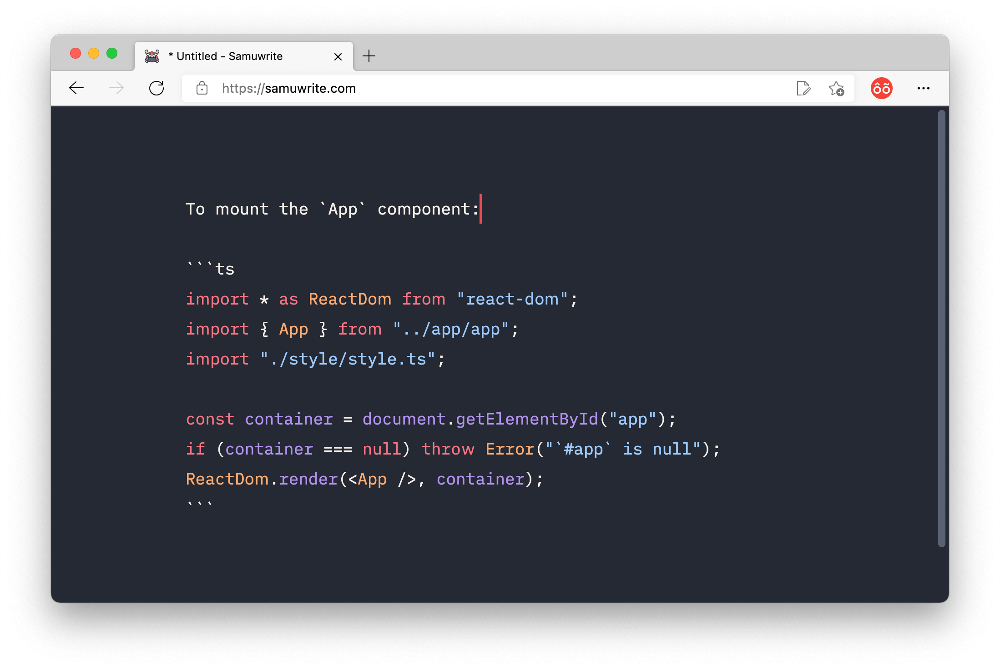
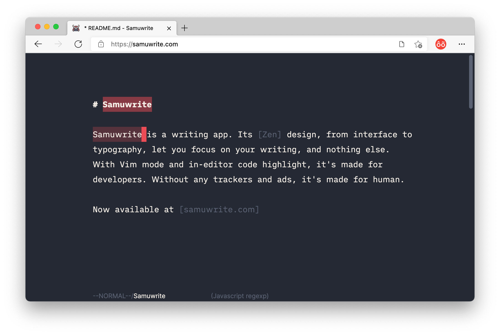
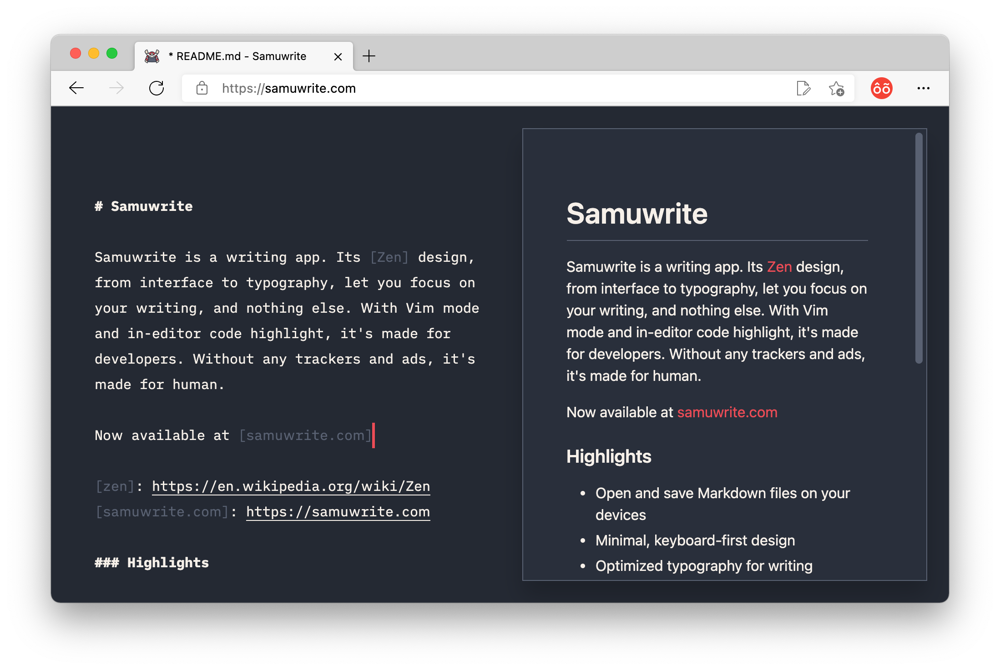
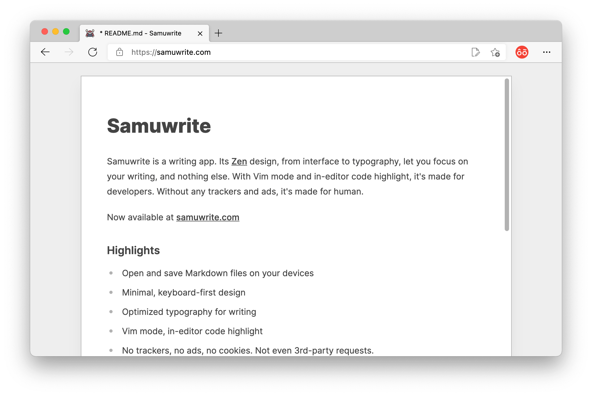
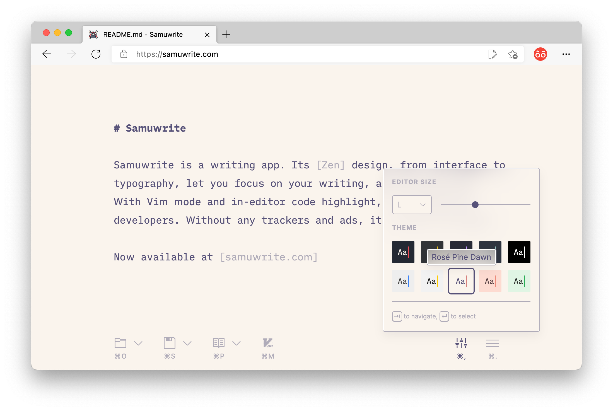
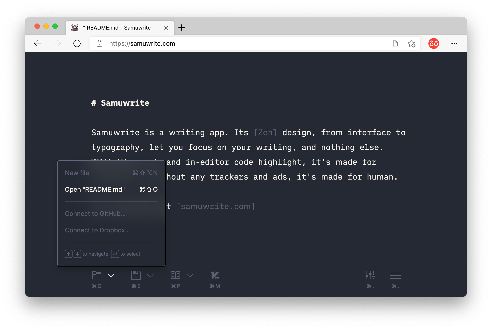

# [Samuwrite](https://samuwrite.com)

Samuwrite is a writing app. Its [Zen] design, from interface to typography, let you focus on your writing, and nothing else. With Vim mode and in-editor code highlight, it's made for developers. Without any trackers and ads, it's made for human.

Now available at [samuwrite.com]

[zen]: https://en.wikipedia.org/wiki/Zen
[samuwrite.com]: https://samuwrite.com

## Highlights

|                                                                             |                                                                                     |
| :-------------------------------------------------------------------------: | :---------------------------------------------------------------------------------: |
|     No trackers, no ads     |    Real desktop-class saving    |
|  In-editor code highlight |                      Vim mode                      |
|        Real-time preview        |               Ready to print               |
|             Custom theme             |  Keyboard-first interaction |

## Development

Samuwrite is an [open-source project](https://opensource.guide/)! We will add a detailed contributing guide soon, but for now please see [development.md](/docs/development.md).

### Team

|  |  |  |
| :----------------------------------------------------------------------------------------------------------------------: | :----------------------------------------------------------------------------------------------------------------------: | :-----------------------------------------------------------------------------------------------------------------------: |
|                                         [Thien Do](https://github.com/thien-do)                                          |                                         [Huy Nguyen](https://github.com/huyng12)                                         |                                         [Monody Le](https://github.com/monodyle)                                          |
